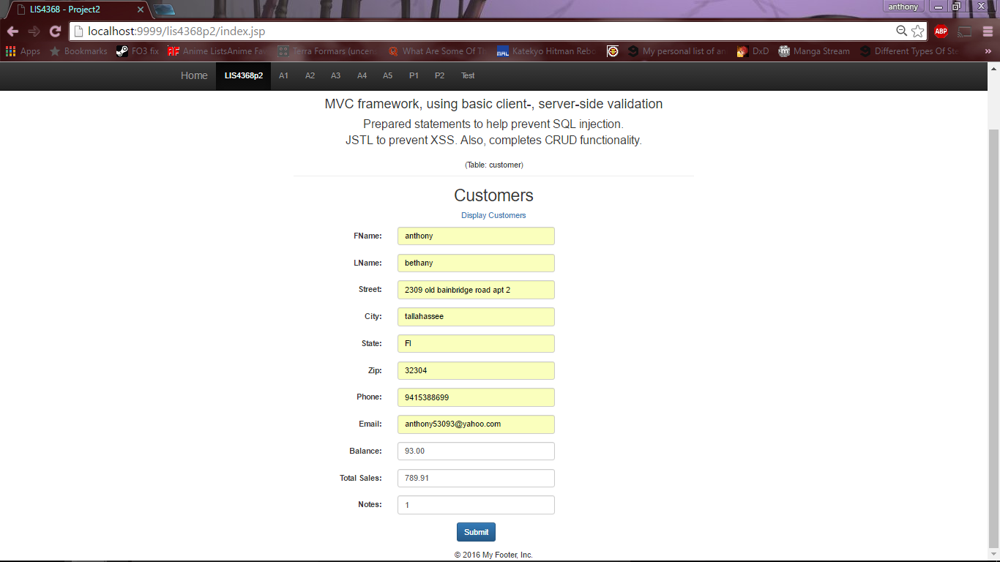
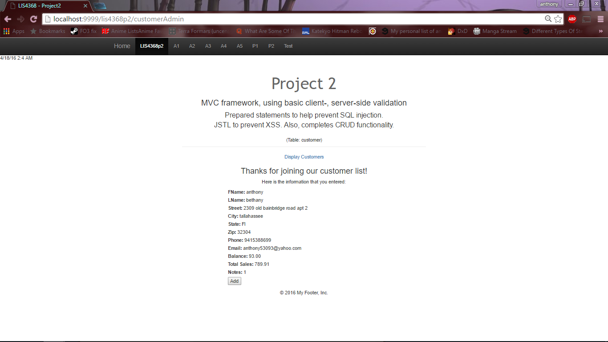
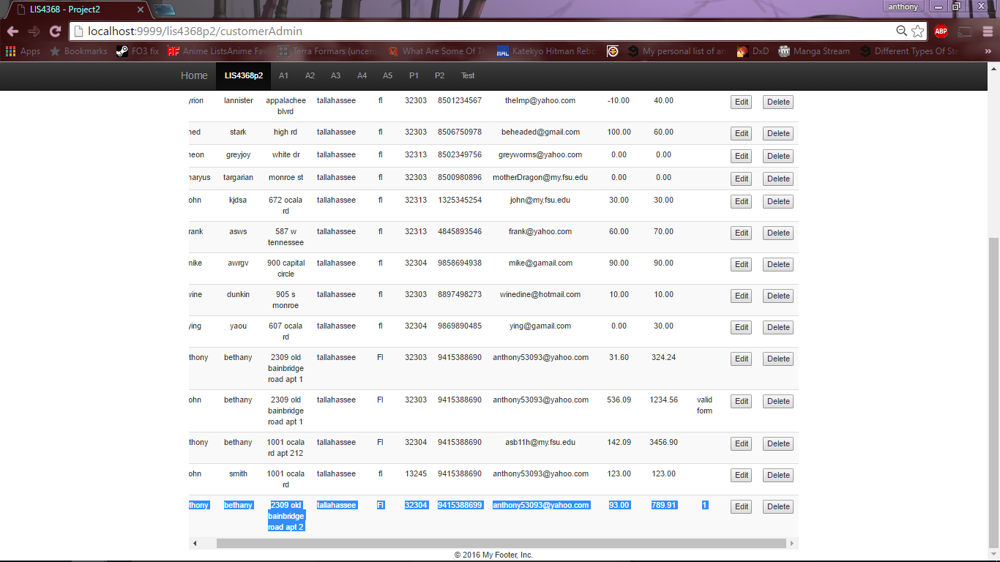
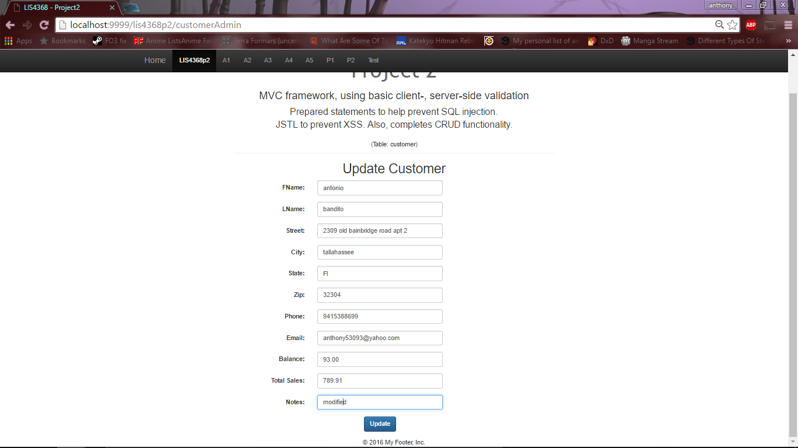
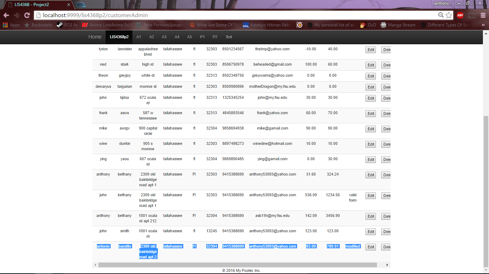
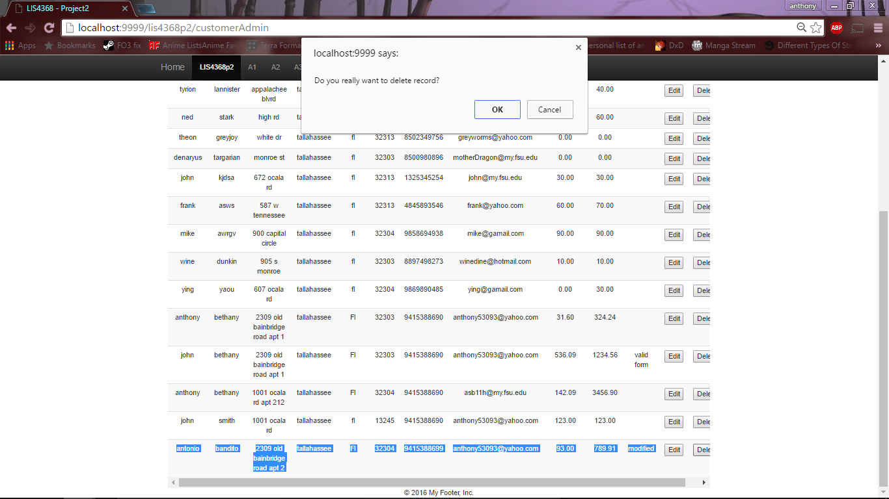
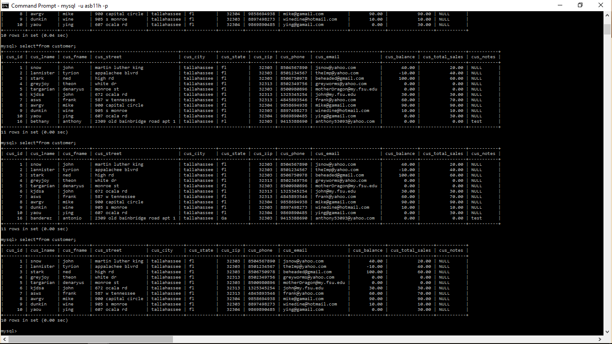

> **NOTE:** This README.md file should be placed at the **root of each of your repos directories.**
>
>Also, this file **must** use Markdown syntax, and provide project documentation as per below--otherwise, points **will** be deducted.
>

# LIS4368

## Anthony Bethany

### p2 Requirements:
1. Do questions first!
2. Add assignment requirements to README.md
3. Add screenshots to README.md
4. Log into MySQL using the command line (or Mac Terminal)
  select * from customer;
5. Fill out all form fields and show thanks.jsp
6. Add new record
7. Show README.md

*three parts*

1. MVC
2. Compile
3. Answer the following questions (Chs. 16 - 17)

#### README.md file should include the following items:

*README.md file should include the following items:*

1. Provide Bitbucket read-only access to p2 repo, *must* include README.md, using Markdown syntax, which displays assignment requirements, screenshots of pre-, post-valid user form entry.
2. Blackboard Links: p2 Bitbucket repo

#### Assignment Screenshots:

*Screenshot of valid insert, passed insert, data display, modify form, modified data, delete warning, and proof of changes*:

#### Links:

1. *p2* [http://localhost:9999/lis4368p2/index.jsp](http://localhost:9999/lis4368p2/index.jsp)